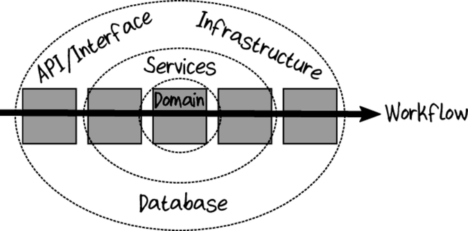

# Domain modeling made functional

## Goals

- Focus on business events and workflows rather than data structures.
- Partition the problem domain into smaller subdomains.
- Create a model of each subdomain in the solution.
- Develop a common language (known as the “Ubiquitous Language”) that is shared between everyone involved in the project and is used everywhere in the code.

## Understand Domain modeling

### Understand domain through business events

Use event storming to discover the domain.
Using paper notes from different colors

- First write down on notes all the events
- Then the command which trigger the events
- Then add the actors (usres or systems)
- Questions can pop up, if there is no answer write it down
- try to find teams responssability area

the aim is to get :

- A shared understaning of the domain (the model)
- An awareness of all the teams
- Find gaps in requirements
- Connections beween teams (ones output is anothers input)
- Awareness of reporting requirements

#### Workflow, Scenario and Business processes

- __Scenario__ : a goal that a customer want to achieve
- __Business process__ : a goal the business want to achieve
- __workflow__ : detail part of a business process

```[Event] -triggers-> [Command] -Input-> [Business workflow] -output-> [List of event]```

Some event are not triggerd by users but by systems or schedulers.

### Domain partitioning

Domain : "area of coherent knowledge" or "what a domain expert is expert in"

Domain can overlap : some domain should know little about another domain.

### Building a solution

The domain is now known bu everything will not go in the system we will build.
We have to go from the problem space to the solution space.

Domain and subdomains are mapped to "bounded contexts".
"Context" because it's one specialized knwoledge, language and design.
"Bounded" because we want decoupled sub domains to ease maintenance.

Sometimes a bounded context handle several domain, this happen especially when dealling with legacy systems.

#### Gettin the right context:


- Listen to domain expert
- Pay attention to existing teams and department boundaries
- don't forget the bounded part of the domain context
- Design for autonomy
- Design for friction free business workflow

#### Creating Context Map

Express relations between contexts with a Context Map.
Context map aims to show contexts interactions.
You can create a series of smaller maps.

Some domains are more important, these are called __core domains__.
Other are called __subdomains__ or __supportative domains__.
Some domains are not specific to the business and are called __generic domains__.

### Creating ubiquitous language

Business term should be used in the domain model and no technical term should be used (Factory, Manager, Helper, ...).
Ubiquitous language is a work in progress and will evolve.
Each context will have it's own __dialect__ of the ubiquitous language.

### Understanding the domain

#### Interviewing the expert

Don't go too much deep in details first. You need to understand the big picture.
Workflows output are generated events. Which may go in other workflows.

#### Domain design

- Don't do database driven design, look for __persistence ignorance__.
- Don't do Class driven design

Example of how to express the model :


```
Bounded context: Order-Taking 	

​ 	Workflow: "Place order"
​ 	   triggered by:
​ 	      "Order form received" event (when Quote is not checked)
​ 	   primary input:
​ 	      An order form
​ 	   other input:
​ 	      Product catalog
​ 	   output events:
​ 	      "Order Placed" event
​ 	   side-effects:
​ 	      An acknowledgment is sent to the customer,
​ 	      along with the placed order
​ 	
​ 	data UnvalidatedOrder =
​ 	    UnvalidatedCustomerInfo
​ 	    AND UnvalidatedShippingAddress
​ 	    AND UnvalidatedBillingAddress
​ 	    AND list of UnvalidatedOrderLine
​ 	
​ 	data UnvalidatedOrderLine =
​ 	    UnvalidatedProductCode
​ 	    AND UnvalidatedOrderQuantity

	data ValidatedOrder =
​ 	    ValidatedCustomerInfo
​ 	    AND ValidatedShippingAddress
​ 	    AND ValidatedBillingAddress
​ 	    AND list of ValidatedOrderLine
​ 	
​ 	data ValidatedOrderLine =
​ 	    ValidatedProductCode
​ 	    AND ValidatedOrderQuantity
​ 	
	data PricedOrder =
​ 	    ValidatedCustomerInfo
​ 	    AND ValidatedShippingAddress
​ 	    AND ValidatedBillingAddress
​ 	    AND list of PricedOrderLine  // different from ValidatedOrderLine
​ 	    AND AmountToBill             // new
​ 	
​ 	data PricedOrderLine =
​ 	    ValidatedOrderLine
​ 	    AND LinePrice                // new

	data PlacedOrderAcknowledgment =
​ 	    PricedOrder
​ 	    AND AcknowledgmentLetter

​ 	data CustomerInfo = ???   // don't know yet
​ 	data BillingAddress = ??? // don't know yet
​ 	
​ 	data WidgetCode = string starting with "W" then 4 digits
​ 	data GizmoCode = string starting with "G" then 3 digits
​ 	data ProductCode = WidgetCode OR GizmoCode

	data OrderQuantity = UnitQuantity OR KilogramQuantity
​ 	
​ 	data UnitQuantity = integer between 1 and ?
​ 	data KilogramQuantity = decimal between ? and ?
```

```
workflow "Place Order" =
​    input: OrderForm
​    output:
​       OrderPlaced event (put on a pile to send to other teams)
​       OR InvalidOrder (put on appropriate pile)
​
​    // step 1
​    do ValidateOrder
​    If order is invalid then:
​        add InvalidOrder to pile
​        stop
​
​    // step 2
​    do PriceOrder
​
​    // step 3
​    do SendAcknowledgmentToCustomer
​
​    // step 4
    return OrderPlaced event (if no errors)
```

```
substep "ValidateOrder" =
​    input: UnvalidatedOrder
​    output: ValidatedOrder OR ValidationError
​    dependencies: CheckProductCodeExists, CheckAddressExists
​
​    validate the customer name
​    check that the shipping and billing address exist
​    for each line:
​        check product code syntax
​        check that product code exists in ProductCatalog
​
​    if everything is OK, then:
​        return ValidatedOrder
​    else:
	        return ValidationError
```

### Functional Architecture

[C4 model](https://c4model.com/) of Simon Brown is a good way of representing design.

A bounded context should be a module with a clear interface. It can be deployed separately (service architecture).
We could go further an make each workflow a deployable (micro-service architecture).

But the main goal is to keep bounded context __decoupled__ and __autonomous__.

The best practice is to start as a monolith and then refactor as decoupled container as needed.

#### Communication between bounded context

Communication can be done with event, as in a micro service or agent system, an internal message queue or a function call in a monolith.


The translation from event to command can be done in the downstream system or in a separate router.

It best to have all data in the transfered object (DTO) or, at least, a the reference of the object in a share storage location.

DTO will have almost the same data than the domain object but is really designed to be shared (serialized, ...).

__Send data__


__Receive data__


Inside the bounded context everything is "trusted" as it had been validated.
Outside of the context, everything should be considered as "untrusted" and shold be validated.
input will be validated at input gate. Output gate ensure no private information leak out of the bounded context.


#### Contracts between bounded contexts

Communication contracts
- __Shared context_ : a shared domain design, modifying it will impact both contexts.
- __Consumer driven contracts__ : the consumer define the contract they need.
- __Conformist__ or __provider driven contract__ : downstream system accept the provided contract.

Outside and inside models are most of the time not the same. To handle the translation there is often need for an __anti corruption layer__.
This __ACL__ prevent internal pure domain to be corrupted by the outside world.

The communication system can be express through a the context map.

Example : 


#### Workflows within bounded context


The input is the command and the outputs are the events to communicate with other workflows.
Workflow only return event, publishing is a separate concern.

Example : 


#### Code structure withing bounded context

Onion architecture


__IO goes to the edges !__

#### Summary

- A __Domain Object__ is an object designed for use only within the boundaries of a context, as opposed to a Data Transfer Object.
- A __Data Transfer Object__, or __DTO__, is an object designed to be serialized and shared between contexts.
- __Shared Kernel__, __Customer/Supplier__, and __Conformist__ are different kinds of relationships between bounded contexts.
- An __Anti-Corruption Layer__, or __ACL__, is a component that translates concepts from one domain to another in order to reduce coupling and allow domains to evolve independently.
- __Persistence Ignorance__ means that the domain model should be based only on the concepts in the domain itself and should not contain any awareness of databases or other persistence mechanisms

