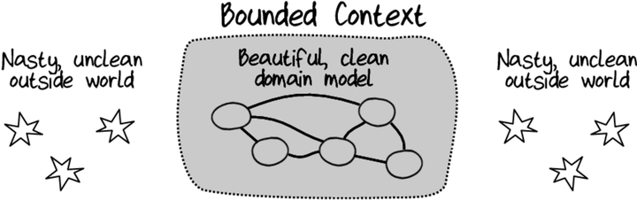
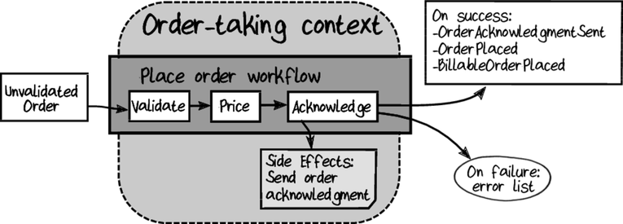
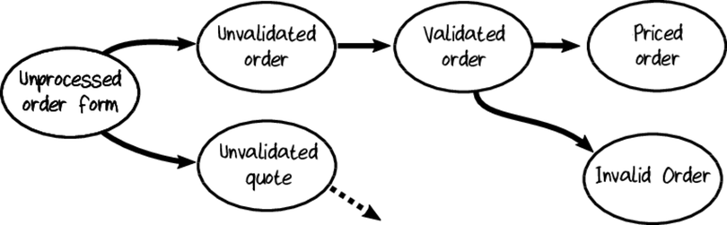
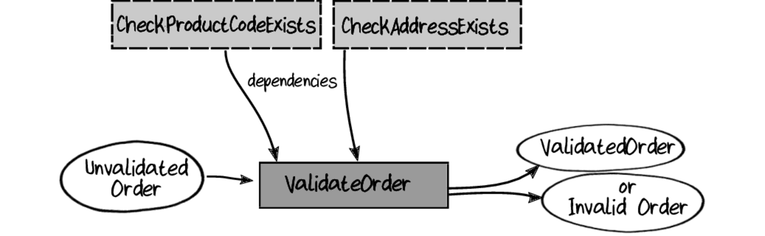
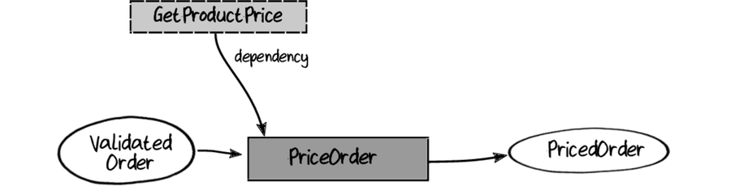
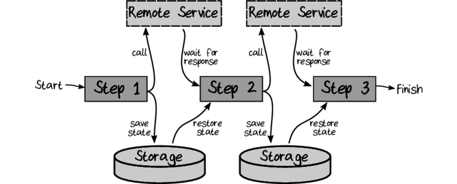
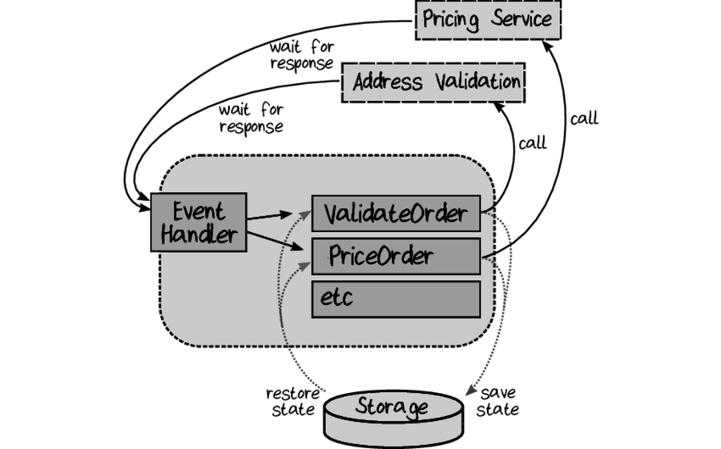

# Domain modeling made functional

All code are available [here](https://pragprog.com/titles/swdddf/source_code)

## Goals

- Focus on business events and workflows rather than data structures.
- Partition the problem domain into smaller subdomains.
- Create a model of each subdomain in the solution.
- Develop a common language (known as the “Ubiquitous Language”) that is shared between everyone involved in the project and is used everywhere in the code.

## Understand Domain modeling

### Understand domain through business events

Use event storming to discover the domain.
Using paper notes from different colors

- First write down on notes all the events
- Then the command which trigger the events
- Then add the actors (usres or systems)
- Questions can pop up, if there is no answer write it down
- try to find teams responssability area

the aim is to get :

- A shared understaning of the domain (the model)
- An awareness of all the teams
- Find gaps in requirements
- Connections beween teams (ones output is anothers input)
- Awareness of reporting requirements

#### Workflow, Scenario and Business processes

- __Scenario__ : a goal that a customer want to achieve
- __Business process__ : a goal the business want to achieve
- __workflow__ : detail part of a business process

```[Event] -triggers-> [Command] -Input-> [Business workflow] -output-> [List of event]```

Some event are not triggerd by users but by systems or schedulers.

### Domain partitioning

Domain : "area of coherent knowledge" or "what a domain expert is expert in"

Domain can overlap : some domain should know little about another domain.

### Building a solution

The domain is now known bu everything will not go in the system we will build.
We have to go from the problem space to the solution space.

Domain and subdomains are mapped to "bounded contexts".
"Context" because it's one specialized knwoledge, language and design.
"Bounded" because we want decoupled sub domains to ease maintenance.

Sometimes a bounded context handle several domain, this happen especially when dealling with legacy systems.

#### Gettin the right context:


- Listen to domain expert
- Pay attention to existing teams and department boundaries
- don't forget the bounded part of the domain context
- Design for autonomy
- Design for friction free business workflow

#### Creating Context Map

Express relations between contexts with a Context Map.
Context map aims to show contexts interactions.
You can create a series of smaller maps.

Some domains are more important, these are called __core domains__.
Other are called __subdomains__ or __supportative domains__.
Some domains are not specific to the business and are called __generic domains__.

### Creating ubiquitous language

Business term should be used in the domain model and no technical term should be used (Factory, Manager, Helper, ...).
Ubiquitous language is a work in progress and will evolve.
Each context will have it's own __dialect__ of the ubiquitous language.

### Understanding the domain

#### Interviewing the expert

Don't go too much deep in details first. You need to understand the big picture.
Workflows output are generated events. Which may go in other workflows.

#### Domain design

- Don't do database driven design, look for __persistence ignorance__.
- Don't do Class driven design

Example of how to express the model :


```
Bounded context: Order-Taking 	

 	Workflow: "Place order"
 	   triggered by:
 	      "Order form received" event (when Quote is not checked)
 	   primary input:
 	      An order form
 	   other input:
 	      Product catalog
 	   output events:
 	      "Order Placed" event
 	   side-effects:
 	      An acknowledgment is sent to the customer,
 	      along with the placed order
 	
 	data UnvalidatedOrder =
 	    UnvalidatedCustomerInfo
 	    AND UnvalidatedShippingAddress
 	    AND UnvalidatedBillingAddress
 	    AND list of UnvalidatedOrderLine
 	
 	data UnvalidatedOrderLine =
 	    UnvalidatedProductCode
 	    AND UnvalidatedOrderQuantity

	data ValidatedOrder =
 	    ValidatedCustomerInfo
 	    AND ValidatedShippingAddress
 	    AND ValidatedBillingAddress
 	    AND list of ValidatedOrderLine
 	
 	data ValidatedOrderLine =
 	    ValidatedProductCode
 	    AND ValidatedOrderQuantity
 	
	data PricedOrder =
 	    ValidatedCustomerInfo
 	    AND ValidatedShippingAddress
 	    AND ValidatedBillingAddress
 	    AND list of PricedOrderLine  // different from ValidatedOrderLine
 	    AND AmountToBill             // new
 	
 	data PricedOrderLine =
 	    ValidatedOrderLine
 	    AND LinePrice                // new

	data PlacedOrderAcknowledgment =
 	    PricedOrder
 	    AND AcknowledgmentLetter

 	data CustomerInfo = ???   // don't know yet
 	data BillingAddress = ??? // don't know yet
 	
 	data WidgetCode = string starting with "W" then 4 digits
 	data GizmoCode = string starting with "G" then 3 digits
 	data ProductCode = WidgetCode OR GizmoCode

	data OrderQuantity = UnitQuantity OR KilogramQuantity
 	
 	data UnitQuantity = integer between 1 and ?
 	data KilogramQuantity = decimal between ? and ?
```

```
workflow "Place Order" =
    input: OrderForm
    output:
       OrderPlaced event (put on a pile to send to other teams)
       OR InvalidOrder (put on appropriate pile)

    // step 1
    do ValidateOrder
    If order is invalid then:
        add InvalidOrder to pile
        stop

    // step 2
    do PriceOrder

    // step 3
    do SendAcknowledgmentToCustomer

    // step 4
    return OrderPlaced event (if no errors)
```

```
substep "ValidateOrder" =
    input: UnvalidatedOrder
    output: ValidatedOrder OR ValidationError
    dependencies: CheckProductCodeExists, CheckAddressExists

    validate the customer name
    check that the shipping and billing address exist
    for each line:
        check product code syntax
        check that product code exists in ProductCatalog

    if everything is OK, then:
        return ValidatedOrder
    else:
	        return ValidationError
```

### Functional Architecture

[C4 model](https://c4model.com/) of Simon Brown is a good way of representing design.

A bounded context should be a module with a clear interface. It can be deployed separately (service architecture).
We could go further an make each workflow a deployable (micro-service architecture).

But the main goal is to keep bounded context __decoupled__ and __autonomous__.

The best practice is to start as a monolith and then refactor as decoupled container as needed.

#### Communication between bounded context

Communication can be done with event, as in a micro service or agent system, an internal message queue or a function call in a monolith.


The translation from event to command can be done in the downstream system or in a separate router.

It best to have all data in the transfered object (DTO) or, at least, a the reference of the object in a share storage location.

DTO will have almost the same data than the domain object but is really designed to be shared (serialized, ...).

__Send data__


__Receive data__


Inside the bounded context everything is "trusted" as it had been validated.
Outside of the context, everything should be considered as "untrusted" and shold be validated.
input will be validated at input gate. Output gate ensure no private information leak out of the bounded context.


#### Contracts between bounded contexts

Communication contracts
- __Shared context_ : a shared domain design, modifying it will impact both contexts.
- __Consumer driven contracts__ : the consumer define the contract they need.
- __Conformist__ or __provider driven contract__ : downstream system accept the provided contract.

Outside and inside models are most of the time not the same. To handle the translation there is often need for an __anti corruption layer__.
This __ACL__ prevent internal pure domain to be corrupted by the outside world.

The communication system can be express through a the context map.

Example : 


#### Workflows within bounded context


The input is the command and the outputs are the events to communicate with other workflows.
Workflow only return event, publishing is a separate concern.

Example : 


#### Code structure withing bounded context

Onion architecture


__IO goes to the edges !__

#### Summary

- A __Domain Object__ is an object designed for use only within the boundaries of a context, as opposed to a Data Transfer Object.
- A __Data Transfer Object__, or __DTO__, is an object designed to be serialized and shared between contexts.
- __Shared Kernel__, __Customer/Supplier__, and __Conformist__ are different kinds of relationships between bounded contexts.
- An __Anti-Corruption Layer__, or __ACL__, is a component that translates concepts from one domain to another in order to reduce coupling and allow domains to evolve independently.
- __Persistence Ignorance__ means that the domain model should be based only on the concepts in the domain itself and should not contain any awareness of databases or other persistence mechanisms

## Domain modeling

### Algebraic type system

#### Understanding functions and types

A function is a transformation

A type is a set of possible values that can be used as input or output of a function.

A value is an element of a type.

A function can be a type

You create a new type from existing ones by using AND and OR.

__AND__ means you need a value for each. This is a __product type__.

__OR__ means you need one from all possible values. This is a __sum type__

> We can define a choice of only one element to create a an __alias__

#### Domain modeling with types

The domain model should represent the business model and should be understandable by the business. It then becomes a documentation. this documentation can not become out of sync since it's the code itself.

#### Patterns in domain model

- __Simple values__ which are primitives (such as integer or string). These are not string or integer but ProductCode or OrderId which are concepts in the ubiquitous language.
- __Combinations of values__ with AND
- __Choices of values__ with OR
- __Workflows__, the business processes which has inputs and outputs

Workflows will be represented as functions. When a workflow has several outputs a special type can be created to represent it.

Effects can be added to the returned type to express more precisely how the process will behave. For example, the function can failed and be async. So the function return type would be Async<Result<a, ValidationError>>.

We can create a new type to ease reading : 

```F#
type ValidationResponse<'a> = Async<Result<'a,ValidationError list>>
```

#### Identities

- __Value objects__ are types without identities.
- __Entities__ have an identity other than the contained values.

Entities need identifier. In case of a choice of values it is easier to works with the identifier placed on each choice.

F# code of an entity :

```F#
[<NoEquality; NoComparison>]
 	type Contact = {
 	  ContactId : ContactId
 	  PhoneNumber : PhoneNumber
 	  EmailAddress: EmailAddress
 	  }
 	  
printfn "%b" (contact1.ContactId = contact2.ContactId) // true
```

Composite keys are also possible.

__All types will be immutable so far.__

#### Aggregates

When an entity contains several entities and changing a sub-entities change the top level then this grape of entities is called an aggregate.

Aggregates are useful to ensure the __consistency__ of the values.

When an Aggregate references another one it should be through its reference (identifier).

- An aggregate is a collection of domain objects that can be treated as a single unit, with the top-level Entity acting as the  “root.”
- All of the changes to objects inside an aggregate must  be applied via the top level to the root, and the aggregate acts as a  consistency boundary to ensure that all of the data inside the aggregate is updated correctly at the same time.
- An aggregate is the atomic unit of persistence, database transactions, and data transfer.

### Integrity and Consistency in the domain

Goal :



Quick definitions :

- __Integrity__: pieces of data follow business rules.
- __Consistency__: different parts of the domain agree about facts.

#### Simple values

Make constructor private and use a factory function which do the verifications.

In FP this is the __smart constructor__.

```F#
type UnitQuantity = private UnitQuantity of int
//                  ^ private constructor

// define a module with the same name as the type
module UnitQuantity =

  /// Define a "smart constructor" for UnitQuantity
  /// int -> Result<UnitQuantity,string>
  let create qty =
    if qty < 1 then
      // failure
      Error "UnitQuantity can not be negative"
    else if qty > 1000 then
      // failure
      Error "UnitQuantity can not be more than 1000"
    else	
      // success -- construct the return value
      Ok (UnitQuantity qty)	
```

A downside is that the constructor can't be used to pattern match anymore.

There is common code for construction, examples are in `Domain.SimpleTypes.fs`

#### Unit of measure

```F#
[<Measure>]
type kg

[<Measure>]
type m

let fiveKilos = 5.0<kg>
let fiveMeters = 5.0<m>
```

All unit of th SI system are already available here : `Microsoft.FSharp.Data.UnitSystems.SI`.

#### Enforce invariant with the type system

Example with a NonEmptyList :

```F#
type NonEmptyList<'a> = {
 First: 'a
 Rest: 'a list
}
```

This list can never be empty.

#### Capturing business rule in the type system

Create a type for the unverified data and another for the verified one.

```F#
type CustomerEmail =
  | Unverified of EmailAddress
  | Verified of VerifiedEmailAddress // different from normal EmailAddress, has its private constructor
  
```

Create a type to represent different possible states :

```F#
type BothContactMethods = {
  Email: EmailContactInfo
  Address : PostalContactInfo
  }
	
type ContactInfo =
    | EmailOnly of EmailContactInfo
    | AddrOnly of PostalContactInfo
    | EmailAndAddr of BothContactMethods

type Contact = {
  Name: Name
  ContactInfo : ContactInfo
  }
```

__Make illegal state unrepresentable in our domain__

#### Consistency

##### Consistency of an aggregate

In an __aggregate__ consistency should be verified at top level 

##### Consistency between domains

Domains communicate through events. When an event is lost there is several ways to deal with inconsistency:

- __Do nothing__, the inconsistency is not very bad and it will not cost that much.
- __Detect__ the lost message and __resend it__.
- Run a __compensation action__ which "undo" the previous action.

There is also two phase commit but it's rarely really needed. 

Most of the time consistency will be eventual (which is not optional).

##### Consistency between aggregates of the same bounded context

Same __transaction__ of __eventual consistency__ ?

In general eventual consistency through events is enough.

But when the workflow is considered as a single transaction by the business (for example : a money transfer), it may be good to do a single transaction. It might also be an insight that there is need for refactoring.

You shouldn't feel obligated to reuse existing aggregate, when there is need for an aggregate just for one use case, do it.

##### Multiple aggregate on same data

Sometimes, two aggregates operate on the same data and have to verify the same integrity constraint.

In most cases constraints can be shared (if modeled using types). If a type is not applicable, then a validation function can be shared. 

### Modeling Workflows as pipelines

We will do __transformation-oriented programming__.



#### Workflow input

It should be a domain object, always. But it can be an unvalidated one (Example: UnvalidatedOrder), or a command containing the deserialized object.

```F#
type PlaceOrder = {
  OrderForm : UnvalidatedOrder
  Timestamp: DateTime
  UserId: string
  // etc
  }
```

Fields common to all command can be put in a reusable generic command :

```F#
type Command<'data> = {
  Data : 'data
  Timestamp: DateTime
  UserId: string
  // etc
  }
  
type PlaceOrder = Command<UnvalidatedOrder>
```

#### Modeling Order as a set of states



Create a new type for each state. It remove implicit states and conditional fields.

When adding new states, the existing code will not be impacted.

#### State machines

What was defined is a state machine.

The advantage of using a state machine are : 

- Each states can have different behavior.
- All states are explicitly documented
- It is a design tool that enforce you to think about every possibility that could occur.

How to do it :

- Every state has its own type.
- The set of states is represented by a choice. 
- A command handler accept all the possible states and return a new one (which can be the same).

From the caller's point of view the set of states is one thing but internally each are treated separately.

#### Modeling each Step of the workflow with types

##### Validation



```F#
type CheckProductCodeExists =
  ProductCode -> bool
  // ^input      ^output
  
type CheckedAddress = CheckedAddress of UnvalidatedAddress

type AddressValidationError = AddressValidationError of string
 	
 	type CheckAddressExists =
 	  UnvalidatedAddress -> Result<CheckedAddress,AddressValidationError>
 	  // ^input                    ^output

type ValidateOrder =
 	  CheckProductCodeExists    // dependency
 	    -> CheckAddressExists   // dependency
 	    -> UnvalidatedOrder     // input
 	    -> Result<ValidatedOrder,ValidationError>  // output
```

##### Pricing steps



```F#
type GetProductPrice =
 	  ProductCode -> Price

type PriceOrder =
 	  GetProductPrice      // dependency
 	    -> ValidatedOrder  // input
 	    -> PricedOrder     // output
```

##### The acknowledge step

```F#
type HtmlString =
 	  HtmlString of string
 	
 	type OrderAcknowledgment = {
 	  EmailAddress : EmailAddress
 	  Letter : HtmlString
 	  }

type CreateOrderAcknowledgmentLetter =
 	  PricedOrder -> HtmlString

type SendResult = Sent | NotSent
 	
 	type SendOrderAcknowledgment =
 	  OrderAcknowledgment -> SendResult

type OrderAcknowledgmentSent = {
 	  OrderId : OrderId
 	  EmailAddress : EmailAddress
 	  }

type AcknowledgeOrder =
  CreateOrderAcknowledgmentLetter     // dependency
    -> SendOrderAcknowledgment        // dependency
    -> PricedOrder                    // input
    -> OrderAcknowledgmentSent option // output
```

##### Creating the events to return

```F#
type OrderPlaced = PricedOrder
 	type BillableOrderPlaced = {
 	  OrderId : OrderId
 	  BillingAddress: Address
 	  AmountToBill : BillingAmount
 	  }

// As we are likely to add new event type a choice is better than a product type
type PlaceOrderEvent =
 	  | OrderPlaced of OrderPlaced
 	  | BillableOrderPlaced of BillableOrderPlaced
 	  | AcknowledgmentSent  of OrderAcknowledgmentSent

type CreateEvents =
 	  PricedOrder -> PlaceOrderEvent list
```

	#### Documenting effects

##### Invalidation step

Combining Async and result will do :

```F#
type AsyncResult<'success,'failure> = Async<Result<'success,'failure>>
```

Now Checking the address will be :

```F#
type CheckAddressExists =
  UnvalidatedAddress -> AsyncResult<CheckedAddress,AddressValidationError>
```

So will Validate Order :

```F#
type ValidateOrder =
  CheckProductCodeExists    // dependency
    -> CheckAddressExists   // AsyncResult dependency
    -> UnvalidatedOrder     // input
    -> AsyncResult<ValidatedOrder,ValidationError list>  // output
```

##### In the pricing step

```F#
type PricingError = PricingError of string
 	
type PriceOrder =
  GetProductPrice                       // dependency
    -> ValidatedOrder                   // input
    -> Result<PricedOrder,PricingError> // output
```

##### In the acknowledge step

```F#
type SendOrderAcknowledgment =
  OrderAcknowledgment -> Async<SendResult>
  
type AcknowledgeOrder =
  CreateOrderAcknowledgmentLetter     // dependency
    -> SendOrderAcknowledgment        // Async dependency
    -> PricedOrder                    // input
    -> Async<OrderAcknowledgmentSent option> // Async output
```

#### Composing workflow from steps

Actual definition of steps :

```F#
type ValidateOrder =
  UnvalidatedOrder                                       // input
    -> AsyncResult<ValidatedOrder,ValidationError list>  // output

type PriceOrder =
  ValidatedOrder                            // input
    -> Result<PricedOrder,PricingError>     // output

type AcknowledgeOrder =
  PricedOrder                                // input
    -> Async<OrderAcknowledgmentSent option> // output

type CreateEvents =
    PricedOrder               // input
      -> PlaceOrderEvent list // output
```

#### Are dependencies part of the design ?

- For exposed functions of a public API, hide dependency information from caller.
- For function to use internally, be explicit about their dependencies. 

Here we should expose :

```F#
type PlaceOrderWorkflow =
  PlaceOrder                                             // input
    -> AsyncResult<PlaceOrderEvent list,PlaceOrderError> // output	
```

#### Complete pipeline

See the example code of the book.

In resume : 

- In a first file :
  - The input data types
  - The Command types
  - The public API :
    - The public function
    - The different result types
- In another file :
  - All the states
  - All the internal steps

#### Long running workflows

How would it affect the design if :

- the workflow can not be done in a short time
- some step are done by another service / a user

We would need to store the state, wait for the async task to be done, reload the state and continue the workflow.





Some times these kind of long running workflows are called __Sagas__.

In case thing gets complicated we could be in need of a __Process manager__.

## Implementing the model


